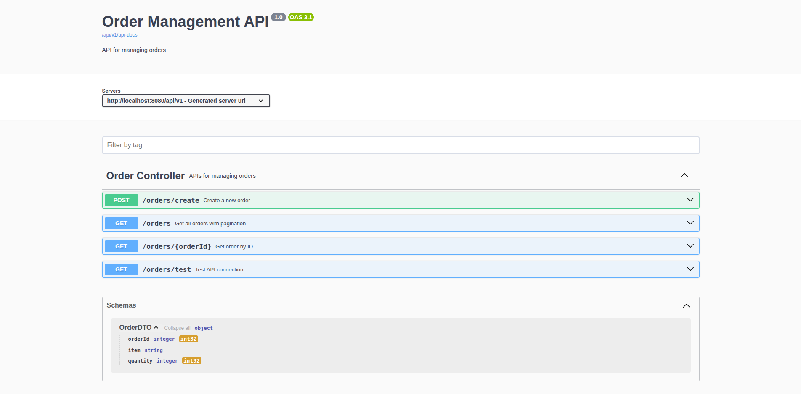
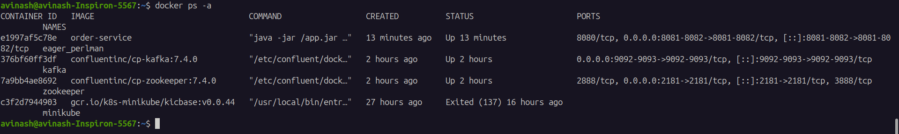
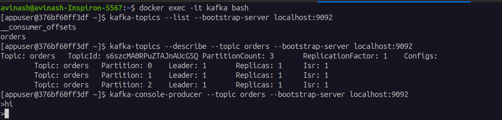
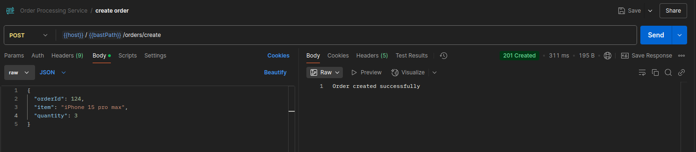
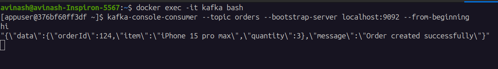
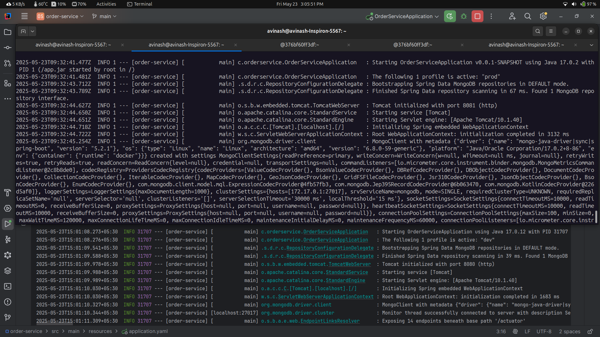

# Order Service

A Spring Boot microservice for managing orders with MongoDB persistence and Kafka messaging integration.

## Tech Stack

- **Java 17**
- **Spring Boot 3.4.5**
- **MongoDB**
- **Apache Kafka**
- **Actuator**
- **SpringDoc OpenAPI**
- **JUnit 5 & Mockito**
- **Maven**
- **Docker**

## API Endpoints

### Orders API
- `GET /api/v1/orders/test` - Test connection
- `POST /api/v1/orders/create` - Create new order
- `GET /api/v1/orders/{orderId}` - Get order by ID
- `GET /api/v1/orders?page=0&size=20` - Get all orders with pagination

## Key Implementations

- Event-Driven Architecture using Kafka
- Global Exception handling
- Unit testing for controllers and services
- Monitoring health checks and metrics using actuator at `/api/v1/actuator`
- Swagger UI available at `/api/v1/swagger-ui/index.html`
- OpenAPI documentation at `/api/v1/api-docs`
- Dockerize everything and run as docker image
- Spring profiling to handle different environments



## Running the Application

### Prerequisites
- Java 17
- MongoDB
- Apache Kafka

### Configuration
Key configurations in `application.yaml`:
```yaml
spring:
  data:
    mongodb:
      uri: mongodb://localhost:27017/
      database: assignment
    kafka:
    bootstrap-servers: kafka:9092
    consumer:
       group-id: order-service-group
       auto-offset-reset: earliest
       key-deserializer: org.springframework.kafka.support.serializer.ErrorHandlingDeserializer
       value-deserializer: org.springframework.kafka.support.serializer.ErrorHandlingDeserializer
       properties:
          spring.deserializer.key.delegate.class: org.apache.kafka.common.serialization.StringDeserializer
          spring.deserializer.value.delegate.class: org.springframework.kafka.support.serializer.JsonDeserializer
          spring.json.trusted.packages: "*"
    producer:
       key-serializer: org.apache.kafka.common.serialization.StringSerializer
       value-serializer: org.springframework.kafka.support.serializer.JsonSerializer
```

### Build and Run
```
# Build the project
mvn clean install

# Run the application
mvn spring-boot:run
```

### Running Tests
``` 
# Run test
mvn test
```
## Docker images


Create a network if not present 
```
docker network create kafka-net
```

1. Pull and run zookeeper
   ```
   docker run -d --network kafka-net  --name zookeeper \
   -p 2181:2181 \
   -e ZOOKEEPER_CLIENT_PORT=2181 \
   -e ZOOKEEPER_TICK_TIME=2000 \
   confluentinc/cp-zookeeper:7.4.0
   ```
2. Pull and run kafka
   ```
   docker run -d --network kafka-net --name kafka \
   -p 9092:9092 -p 9093:9093 \
   -e KAFKA_BROKER_ID=1 \
   -e KAFKA_ZOOKEEPER_CONNECT=zookeeper:2181 \
   -e KAFKA_LISTENERS=PLAINTEXT://0.0.0.0:9092,EXTERNAL://0.0.0.0:9093 \
   -e KAFKA_ADVERTISED_LISTENERS=PLAINTEXT://kafka:9092,EXTERNAL://localhost:9093 \
   -e KAFKA_LISTENER_SECURITY_PROTOCOL_MAP=PLAINTEXT:PLAINTEXT,EXTERNAL:PLAINTEXT \
   -e KAFKA_INTER_BROKER_LISTENER_NAME=PLAINTEXT \
   -e KAFKA_OFFSETS_TOPIC_REPLICATION_FACTOR=1 \
   confluentinc/cp-kafka:7.4.0

   ```
3. Build and run order-service spring boot application
   ```
   docker build -t order-service . --no-cache
   docker run --network kafka-net -p 8081:8081 -p 8082:8082 order-service \
   --name order-service-prod \
   -e SPRING_PROFILES_ACTIVE=prod 
   ```

## Kafka Implementation

Get into the bash and initialise producer


Creating a new order via api in postman


Get into bash and initialise consumer.
Both producer's message and order created message is consumed by consumer


## Environment Profiling
I have created two profiles, 
- dev
- prod

One profile with local config and other with the prod level configs. Both are running independently (local IDE and Docker container) at different ports.
- Dev (local) is running in port 8080 and has exposed all the actuator endpoints
- Prod (container) is running in port 8081 and the actuator is exposed in port 8082 with just health endpoint


## Postman Collection

### API Endpoints Collection
The Postman collection is available at: `/postman/Order-Service.postman_collection.json`

### Environment Variables
Update the following postman variables:
- `host`: Host URL of the service (default: http://localhost:8080)
- `base_url`: Base URL of the service (/api/v1) 

### Available Requests
1. **Test Connection**
    - GET `/orders/test`
    - Tests if the service is up and running

2. **Create Order**
    - POST `/orders/create`
    - Sample Request Body:
      ```json
      {
          "orderId": 1,
          "item": "iPhone",
          "quantity": 2
      }
      ```

3. **Get Order by ID**
    - GET `/orders/{orderId}`
    - Uses the `order_id` environment variable

4. **Get All Orders**
    - GET `/orders?page=0&size=20`
    - Supports pagination parameters


I would also try to implement few more functionalities to this project in the future, such as,
1. Add more api endpoints
2. Host it in some remote vm
3. Implement Spring cloud config
4. Implement Service discovery, Service gateway and Api-gateway